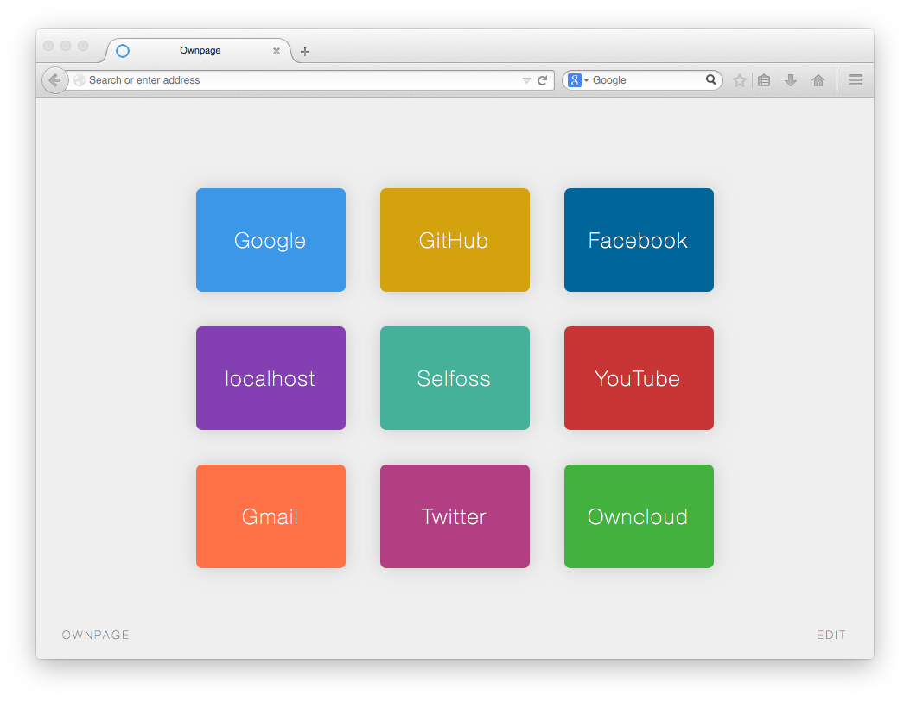

# Ownpage

Alternative home page and new tab page for your browser.

[DEMO - TRY IT - USE IT](http://ricain.github.io/ownpage/)



#####Usage:

You can either install OwnPage on your computer or server, but you can also use it from [here](http://ricain.github.io/ownpage/). All your data are stored locally and are never sent to any server.

#####Install:

```
$ git clone -b gh-pages https://github.com/ricain/ownpage
```
or [download zip](https://github.com/Ricain/ownpage/archive/gh-pages.zip).

Open `index.html` with your favorite browser and make it your home page.

In order to use a custom page for new tab page, use:

- Mozilla Firefox: [New Tab Homepage add-ons](https://addons.mozilla.org/en-US/firefox/addon/new-tab-homepage/)
- Google Chrome: [New Tab Redirect add-ons](https://chrome.google.com/webstore/detail/new-tab-redirect/icpgjfneehieebagbmdbhnlpiopdcmna)
- Safari & IE: no need for add-ons :P

#####Used scripts:

[Colpick](http://colpick.com) (license GNU)

#####License:

[Creative Commons 2.5](http://creativecommons.org/licenses/by/2.5/)

- Free for use in both personal and commercial projects.
- Attribution requires leaving author name, author link, and the license info intact.
